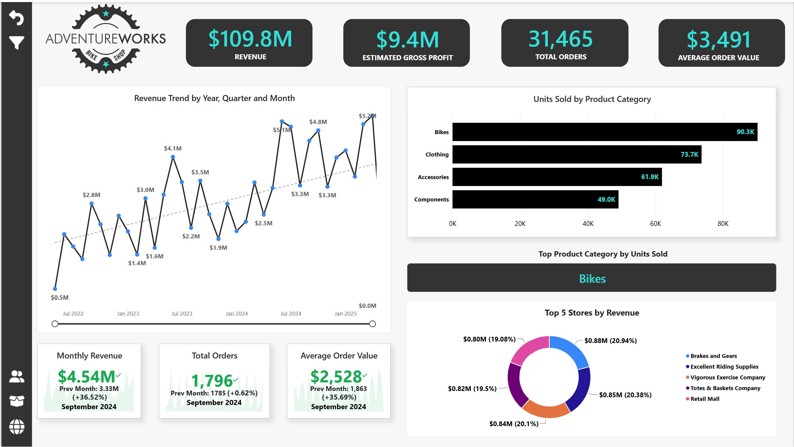
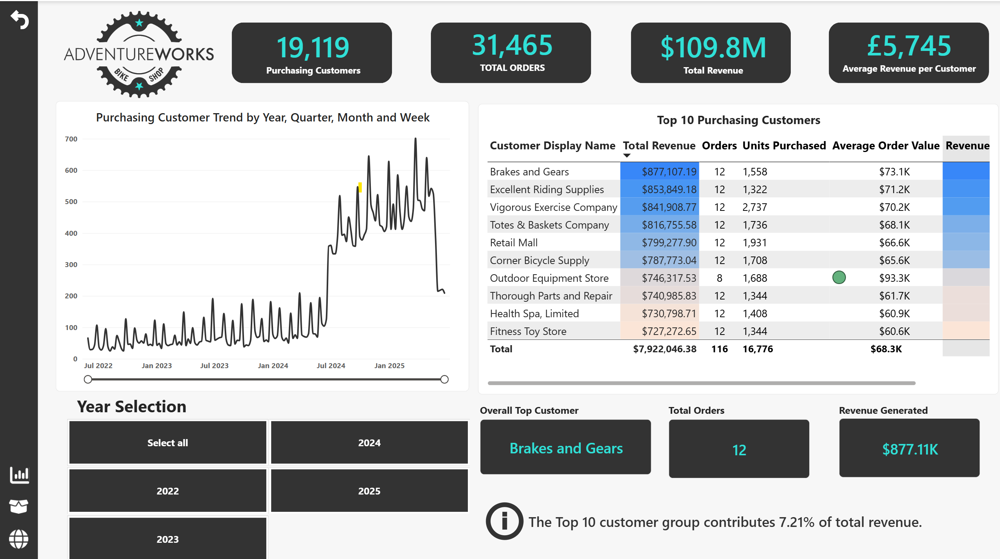
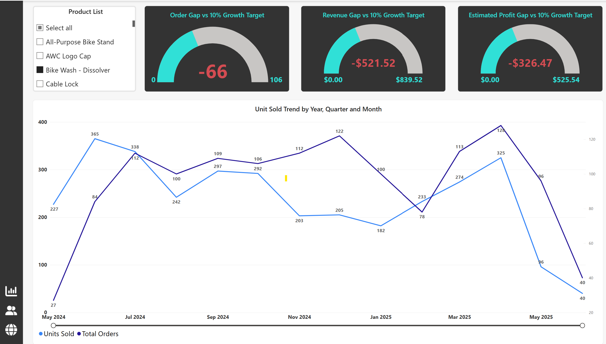
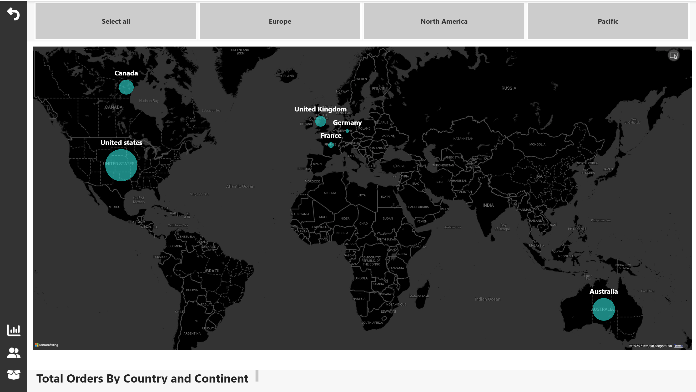

# AdventureWorks Sales and Customer Performance Analysis

## Project Overview

This project analyses the Microsoft **AdventureWorks2025 OLTP database** to understand how sales performance is driven by customers, products, territories, order value and transaction volume.

The analysis combines **SQL Server, Power BI, DAX and business interpretation** to answer practical commercial questions such as:

- Which products and categories drive the most revenue?
- How concentrated is revenue across customers?
- Are high-frequency customers also high-value customers?
- Which territories perform through volume and which through higher-value orders?
- How did performance change between complete calendar years?
- Which customer and order segments contribute most to revenue?
- What operational patterns can be identified from shipping data?

The project follows an end-to-end analytical workflow:

**data validation → SQL analysis → business interpretation → DAX development → Power BI reporting → recommendations**

AdventureWorks is a fictional Microsoft sample business. The project was completed for learning and portfolio purposes.

---

## Quick Navigation

- [Power BI Analysis and Dashboard](#power-bi-analysis-and-dashboard)
- [Power BI Dashboard Preview](#power-bi-dashboard-preview)
- [SQL Analysis](#sql-analysis)
- [Data Quality Validation](#data-quality-validation)
- [Core Business KPIs](#core-business-kpis)
- [Key Business Findings](#key-business-findings)
- [Business Recommendations](#business-recommendations)
- [Skills Demonstrated](#power-bi-skills-demonstrated)
- [Limitations](#limitations)
- [Project Files](#project-files)

---

# Business Objective

The objective was not simply to calculate sales totals, but to identify the commercial patterns behind them.

The analysis focused on four areas:

### Sales Performance

Understanding overall revenue, order volume, average order value and changes over time.

### Customer Performance

Identifying high-value customers, purchasing behaviour, customer concentration and customers with no purchase history.

### Product Performance

Understanding which categories, subcategories and products contribute most strongly to revenue.

### Territory and Operational Performance

Comparing markets with different order-value patterns and assessing basic fulfilment consistency.

---

# Dataset

The project uses the Microsoft **AdventureWorks2025 OLTP sample database**.

## Data Coverage

| Metric | Result |
| :--- | :--- |
| Earliest Order Date | 30 May 2022 |
| Latest Order Date | 29 June 2025 |
| Complete Sales Orders | 31,465 |
| Sales Order Lines | 121,317 |
| Units Sold | 274,914 |
| Customer Records | 19,820 |
| Purchasing Customers | 19,119 |
| Customers With No Linked Purchase History | 701 |

The **2022 and 2025 results are partial years**, so direct annual performance comparisons focus primarily on the complete calendar years **2023 and 2024**.

---

# Tools and Technologies

- **SQL Server 2025 Express**
- **SQL Server Management Studio**
- **SQL**
- **Power BI Desktop**
- **DAX**
- **Power Query**

---

# Data Quality Validation

Before calculating KPIs or interpreting business performance, I validated the main sales tables to ensure the analysis was based on reliable records.

Checks included:

- duplicate sales orders
- invalid or negative order quantities
- negative sales values
- invalid discounts
- missing analytical fields
- unmatched order-detail records
- unmatched products
- unmatched customers
- invalid shipping and due-date sequences
- dataset coverage and record counts

No major data-quality issues were identified in the tested areas.

This validation provided the foundation for the subsequent sales, customer and product analysis.

### Explore the validation work

[View Data Quality SQL](./SQL/01_data_quality_checks.sql)

[View Data Quality Summary](./Findings/data_quality_summary.md)

---

# Core Business KPIs

| KPI | Result |
| :--- | :--- |
| Total Revenue | $109,846,381.40 |
| Total Orders | 31,465 |
| Units Sold | 274,914 |
| Average Order Value | $3,491.07 |
| Purchasing Customers | 19,119 |
| Estimated Gross Profit | $9.37M |
| Estimated Gross Margin | 8.53% |

These KPIs provide the overall business context, but the more important analytical question is **what is driving these results**.

---

# SQL Analysis

The SQL analysis was structured around business questions rather than isolated technical exercises.

Each analysis area combines KPI calculation, segmentation, trend analysis and interpretation.

---

## 1. Overall Sales Performance

### Business Questions

- How much revenue did AdventureWorks generate?
- How many orders and units were sold?
- What was the average order value?
- How did revenue change month by month?
- How did performance change between complete calendar years?
- How much revenue came from low, medium and high-value orders?

### Key Insight

AdventureWorks generated approximately **$109.85M** in revenue from **31,465 orders**.

Between the complete calendar years of **2023 and 2024**, revenue increased by approximately **38.18%**.

However, average order value fell substantially while order and unit volumes increased, indicating that growth was driven more by **transaction volume than larger individual orders**.

The analysis also found that medium and high-value orders generated more than three-quarters of total company revenue despite representing a minority of transactions.

### Techniques Used

`Aggregate Functions` `CTEs` `Date Functions` `LAG()` `Month-over-Month Analysis`<br>
`Annual Comparison` `Conditional Segmentation`  `Percentage Contribution`

[View Overall Sales SQL](./SQL/02_overall_sales_analysis.sql)

---

## 2. Product Performance

### Business Questions

- Which products generate the highest revenue?
- Which product subcategories perform most strongly?
- How concentrated is revenue by category?
- Which products recorded no sales during the available period?

### Key Insight

The **Bikes category generated 86.17% of total company revenue**, making it the dominant commercial product group.

Road Bikes and Mountain Bikes were the strongest subcategories.

At individual product level, **Mountain-200 variants dominated the highest-revenue positions**, with Mountain-200 Black, 38 generating approximately **$4.40M**.

The analysis also identified products with no recorded sales, but these were not automatically classified as underperforming because some may represent internal components or products not intended for direct commercial sale.

### Techniques Used

`Multi-Table Joins` `Aggregation` `Revenue Ranking` `Category Contribution`
<br>
`Subcategory Analysis` `Zero-Sales Identification` `Percentage Calculations`

[View Product Analysis SQL](./SQL/03_product_analysis.sql)

---

## 3. Customer Performance

### Business Questions

- Which customers generate the most revenue?
- Which customers order most frequently?
- Does high purchase frequency always indicate high customer value?
- How concentrated is revenue across customer segments?
- How much revenue is generated by the Top 10 customers?
- How many customer records have no linked purchase history?

### Key Insight

Only **244 high-value customers generated approximately 65.10% of total company revenue**.

However, the **Top 10 customers contributed only 7.21%**, showing that revenue concentration exists across the wider high-value segment rather than being dominated by only a few accounts.

The highest-revenue customers were predominantly **business or store accounts**, while some of the most frequent individual customers placed many orders but generated relatively low revenue.

This demonstrated that **order frequency alone is not a sufficient measure of customer value**.

The analysis also identified:

- **19,119 purchasing customers**
- **701 customer records with no linked purchase history**

These no-purchase records were treated separately from previously active customers.

### Techniques Used

`Customer-Level Aggregation` `Conditional Customer Naming` `Customer Segmentation` 
<br> `Frequency Analysis` `Average Order Value` `Revenue Contribution` `Top N Analysis` 
<br>`Inactivity Analysis` `NULL Handling`

[View Customer Analysis SQL](./SQL/04_customer_analysis.sql)

---

## 4. Territory and Salesperson Performance

### Business Questions

- Which territories generate the highest revenue?
- Which territories rely on high order volume?
- Which territories generate revenue through fewer but higher-value transactions?
- Which salespeople generate the strongest revenue performance?
- Does the salesperson with the most orders also generate the most revenue?

### Key Insight

**Southwest** generated the highest territory revenue at approximately **$24.18M**.

However, territory performance showed different commercial patterns.

For example:

- **Australia** generated high order volume but relatively low average order value
- **Central** generated substantial revenue from far fewer, much higher-value orders

Salesperson analysis showed a similar pattern.

**Linda Mitchell** generated the highest revenue, while **Jillian Carson** processed more orders.

This demonstrates why territory and salesperson performance should be assessed using **revenue, order volume and average order value together**.

### Techniques Used

`Territory Aggregation` `Salesperson Aggregation` `Ranking` `Average Order Value Analysis`
<br> 
`Territory Joins` `Comparative KPI Analysis`

[View Territory and Salesperson SQL](./SQL/05_territory_salesperson_analysis.sql)

---

## 5. Operational Performance

### Business Questions

- How long did orders take to ship?
- Did shipping performance vary by territory?
- Were completed orders shipped after their due date?

### Key Insight

All analysed territories recorded an average shipping duration of approximately **7 days**.

No completed orders were identified where shipment occurred after the due date.

The lack of variation suggests a highly standardised fulfilment pattern, although this may partly reflect the structure of the fictional AdventureWorks dataset.

### Techniques Used

`Date Differences` `Territory-Level Aggregation` `Late-Shipment Validation` `Operational KPI Analysis`

[View Operational Analysis SQL](./SQL/06_operational_analysis.sql)

---

# Power BI Analysis and Dashboard

The Power BI stage translates the SQL analysis into interactive reporting and provides a visual layer for exploring customer, product and sales performance.

Two Power BI files were developed.

---

## 1. Interactive Dashboard

[Download AdventureWorks2025 01-Dashboards.pbix](./POWERBI/AdventureWorks2025%2001-Dashboards.pbix)

The main report includes:

- Executive Dashboard
- Customer Detail
- Product Detail
- Geographic Analysis
- Category Tooltip

---

## 2. Supporting Analytical Outputs

[Download AdventureWorks2025 02-Analytical Outputs.pbix](./POWERBI/AdventureWorks2025%2002-Analytical%20Outputs.pbix)

This file contains supporting analysis and validation tables, including:

- overall sales KPIs
- product revenue validation
- estimated product cost
- estimated gross profit
- estimated gross margin
- customer segment revenue
- customer segment contribution
- order-value segment contribution
- customer revenue by customer
- Top 10 customer contribution
- category revenue contribution
- revenue excluding Bikes
- Top 10 products by revenue

---

# Power BI Dashboard Preview

The screenshots below allow the report to be reviewed directly in GitHub without downloading Power BI Desktop.

---

## Executive Dashboard

The Executive Dashboard provides a concise view of overall business performance.

It combines headline KPIs with sales trends, product performance and store-level revenue.

Key elements include:

- total revenue
- estimated gross profit
- total orders
- average order value
- revenue trend by year, quarter and month
- month-over-month KPI comparison
- units sold by product category
- top-performing product category
- Top 5 stores by revenue



[Download Interactive Dashboard.pbix](./POWERBI/AdventureWorks2025%2001-Dashboards.pbix)

---

## Customer Detail

The Customer Detail page explores customer value, purchasing behaviour and revenue concentration.

It includes:

- purchasing customer count
- total customer revenue
- average revenue per customer
- purchasing customer trend
- Top 10 customers
- revenue contribution
- units purchased
- order count
- average order value
- year-based filtering

Business accounts are displayed using their **store name**, while individual customers are displayed using their **person name**.

The Top 10 customer group contributes **7.21% of total company revenue**.



[Download Interactive Dashboard.pbix](./POWERBI/AdventureWorks2025%2001-Dashboards.pbix)

---

## Product Detail

The Product Detail page allows individual products to be selected and evaluated against previous-month performance targets.

It includes:

- **Order Gap vs 10% Growth Target**
- **Revenue Gap vs 10% Growth Target**
- **Estimated Profit Gap vs 10% Growth Target**
- units sold trend
- total orders trend
- year, quarter and month drill-down

Targets are calculated from previous-month performance with a **10% growth target** applied.



[Download Interactive Dashboard.pbix](./POWERBI/AdventureWorks2025%2001-Dashboards.pbix)

---

## Geographic Analysis

The geographic analysis page compares order activity across major markets.

The report groups markets into:

- Europe
- North America
- Pacific

Countries visualised include:

- United States
- Canada
- United Kingdom
- France
- Germany
- Australia



[Download Interactive Dashboard.pbix](./POWERBI/AdventureWorks2025%2001-Dashboards.pbix)

---

# Power BI Skills Demonstrated

This project demonstrates practical experience in:

- relational data modelling
- Power Query
- DAX measures
- calculated columns
- filter context
- `CALCULATE`
- `DIVIDE`
- `DATEADD`
- `SWITCH`
- `LOOKUPVALUE`
- Top N analysis
- time intelligence
- KPI development
- slicers
- drill-down hierarchies
- visual interactions
- report page tooltips
- month-over-month analysis
- target-based gauge visuals
- geographic analysis
- dashboard design

---

# SQL Skills Demonstrated

- aggregate functions
- joins
- multi-table joins
- common table expressions
- subqueries
- `CASE`
- window functions
- `LAG()`
- ranking functions
- percentage calculations
- date functions
- conditional segmentation
- customer analysis
- order-value segmentation
- `NULL` handling
- data-quality validation
- KPI development

---

# Business Analysis Skills Demonstrated

- KPI definition
- sales performance analysis
- trend interpretation
- customer segmentation
- customer value analysis
- revenue concentration analysis
- product performance analysis
- territory comparison
- salesperson performance analysis
- operational analysis
- translating analytical findings into recommendations

---

# Key Business Findings

The SQL analysis identified several commercially important patterns.

## Revenue Growth Shifted Towards Higher Volume

Revenue increased from approximately **$31.60M in 2023** to **$43.67M in 2024**, representing growth of approximately **38.18%**.

At the same time:

- orders increased from **3,830 to 14,244**
- units sold increased from **66,441 to 131,936**
- average order value fell from approximately **$8,252 to $3,066**

The business therefore grew through substantially greater sales activity rather than larger average transactions.

---

## Bikes Were the Core Revenue Driver

The Bikes category contributed **86.17% of total company revenue**.

Road Bikes and Mountain Bikes were the strongest subcategories, while Mountain-200 products dominated individual product revenue rankings.

This represents both a commercial strength and a concentration risk.

---

## High-Value Customers Were More Important Than the Top 10 Alone

Only **244 customers generated approximately 65.10% of total revenue**.

Yet the Top 10 customers generated only **7.21%**.

This means customer concentration is spread across the wider high-value segment rather than being dependent on a handful of individual accounts.

---

## Medium and High-Value Orders Drove Revenue

Medium and high-value orders represented a minority of transactions but generated more than three-quarters of total revenue.

This highlights the importance of protecting larger transactions even when overall order volume is dominated by lower-value purchases.

---

## Territory Performance Reflected Different Customer Models

Some territories generated performance through **high transaction volume**, while others generated significant revenue from **fewer, much larger orders**.

Revenue alone therefore does not fully explain territory performance.

---

## Customer Frequency Did Not Equal Customer Value

Some individual customers placed 27 to 28 orders but generated very low total revenue.

In contrast, major business accounts generated hundreds of thousands in revenue from relatively few transactions.

Customer analysis therefore needs to combine:

- revenue
- frequency
- average order value

rather than relying on a single KPI.

### Explore the Full Findings

[View Key Business Findings](./Findings/key_business_findings.md)

---

# Business Recommendations

The analysis was translated into practical business recommendations.

The main priorities identified were:

1. Protect the wider high-value customer portfolio.
2. Monitor medium and high-value orders separately.
3. Maintain availability of leading bike product families.
4. Develop selected low-value customers showing growth potential.
5. Explore revenue diversification through complementary categories.
6. Use different commercial strategies for different territory profiles.
7. Assess salespeople using multiple performance measures.
8. Investigate the drivers of monthly revenue volatility.
9. Investigate the shift towards higher order volume and lower average order value.
10. Separate never-purchased customers from previously active customers.
11. Continue monitoring fulfilment consistency.

[View Full Business Recommendations](./Findings/recommendations.md)

---

# Limitations

## Partial-Year Data

The dataset covers **30 May 2022 to 29 June 2025**.

Therefore:

- 2022 is a partial year
- 2025 is a partial year

Direct annual comparisons focus primarily on complete calendar years such as **2023 and 2024**.

---

## Estimated Gross Profit

Estimated gross profit is calculated using the **StandardCost** stored in the Product table.

The calculation does not assign historical `ProductCostHistory` values to individual transactions based on their original order date.

Gross profit and gross margin should therefore be interpreted as **estimated analytical measures rather than exact historical accounting profit**.

---

## Shipping Data

Shipping duration was calculated using whole-number day differences.

Smaller variations measured in hours are not visible.

The identical seven-day average across territories may also reflect the design of the fictional sample database rather than genuine operational variation.

---

## Fictional Dataset

AdventureWorks is a Microsoft sample database.

The findings and recommendations demonstrate analytical methods and business interpretation for portfolio purposes and should not be interpreted as advice provided to a real organisation.

---

# Repository Structure

```text
AdventureWorks_Sales_Analysis/
│
├── README.md
│
├── SQL/
│   ├── 01_data_quality_checks.sql
│   ├── 02_overall_sales_analysis.sql
│   ├── 03_product_analysis.sql
│   ├── 04_customer_analysis.sql
│   ├── 05_territory_salesperson_analysis.sql
│   └── 06_operational_analysis.sql
│
├── Findings/
│   ├── data_quality_summary.md
│   ├── key_business_findings.md
│   └── recommendations.md
│
├── POWERBI/
│   ├── AdventureWorks2025 01-Dashboards.pbix
│   └── AdventureWorks2025 02-Analytical Outputs.pbix
│
└── Images/
    ├── 01_executive_dashboard.png
    ├── 02_customer_detail.png
    ├── 03_product_detail.png
    └── 04_geographic_analysis.png
```

---

# Project Files

## SQL Analysis

[Data Quality Checks](./SQL/01_data_quality_checks.sql)

[Overall Sales Analysis](./SQL/02_overall_sales_analysis.sql)

[Product Analysis](./SQL/03_product_analysis.sql)

[Customer Analysis](./SQL/04_customer_analysis.sql)

[Territory and Salesperson Analysis](./SQL/05_territory_salesperson_analysis.sql)

[Operational Analysis](./SQL/06_operational_analysis.sql)

## Findings

[Data Quality Summary](./Findings/data_quality_summary.md)

[Key Business Findings](./Findings/key_business_findings.md)

[Business Recommendations](./Findings/recommendations.md)

## Power BI Files

[AdventureWorks2025 01-Dashboards.pbix](./POWERBI/AdventureWorks2025%2001-Dashboards.pbix)

[AdventureWorks2025 02-Analytical Outputs.pbix](./POWERBI/AdventureWorks2025%2002-Analytical%20Outputs.pbix)

## Dashboard Images

[Executive Dashboard](./Images/01_executive_dashboard.png)

[Customer Detail](./Images/02_customer_detail.png)

[Product Detail](./Images/03_product_detail.png)

[Geographic Analysis](./Images/04_geographic_analysis.png)

---

# Conclusion

AdventureWorks generated approximately **$109.85M** in revenue from **31,465 orders** during the available reporting period.

The analysis showed that company performance was strongly influenced by:

- the Bikes category
- the wider high-value customer segment
- medium and high-value orders
- distinct territory purchasing patterns
- increasing transaction volume during 2024

One of the most important findings was that although **244 high-value customers generated approximately 65.10% of revenue**, the Top 10 accounts generated only **7.21%**.

This suggests that customer concentration is spread across the wider high-value portfolio rather than being dominated by only a handful of accounts.

The project demonstrates my ability to move from raw relational data to:

**validated data → business questions → SQL analysis → insight generation → DAX measures → interactive reporting → business recommendations**

---

## Author

**Dr Mahreen Kiran**

**Business Data Analyst and BI Analyst**

[View Main Portfolio](../README.md)

[LinkedIn](https://linkedin.com/in/mahreen-kiran)
