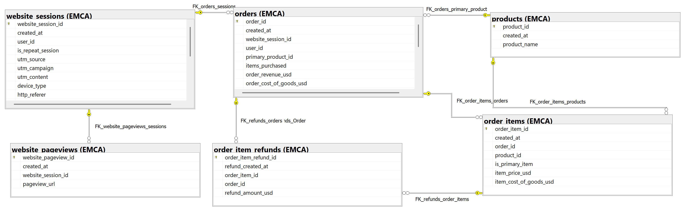
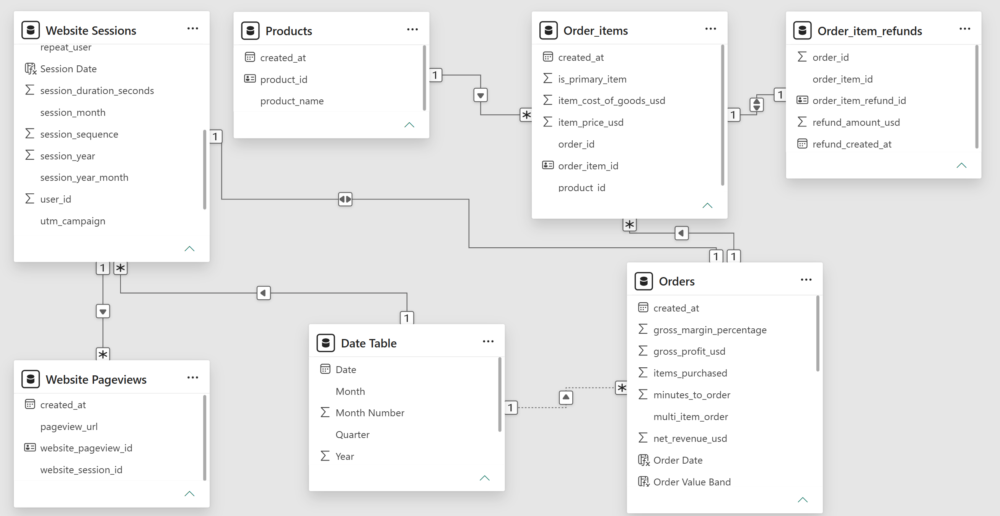
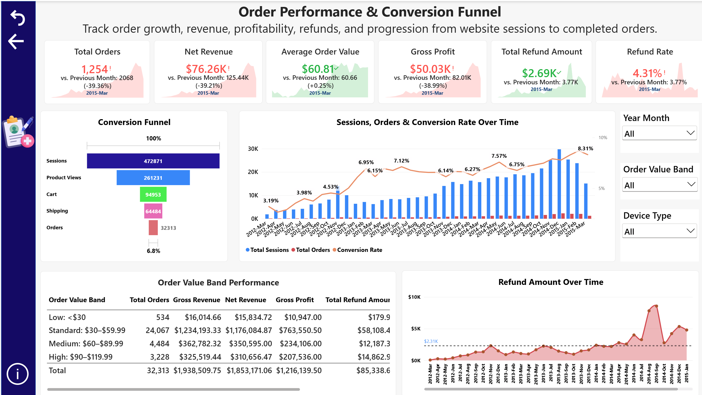
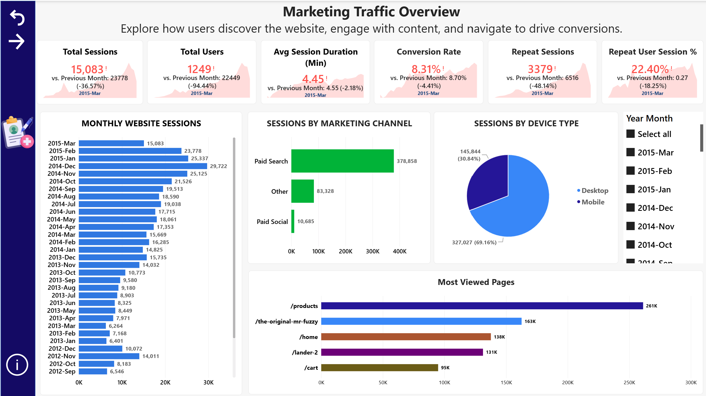

# E-Commerce Marketing, Conversion and Customer Journey Analysis

## Project Overview

This project analyses approximately three years of synthetic e-commerce activity to understand how users discover the website, engage with content, progress through the purchase journey and convert into customers.

The analysis combines **SQL Server, T-SQL, Power BI and DAX** to examine website traffic, marketing acquisition, customer behaviour, conversion, order performance, revenue, profitability, products and refunds.

The project addresses practical business questions such as:

- How did website traffic, orders and revenue change over time?
- Which marketing channels generated the strongest commercial performance?
- How did desktop and mobile users differ in conversion behaviour?
- Which landing pages converted most effectively?
- Where did users drop out of the customer journey?
- Were returning visitors more likely to purchase?
- How did basket size affect revenue and profitability?
- Which products generated the most revenue?
- How significant was refund activity?
- Did the strongest revenue months also produce the strongest conversion rates?

The project follows an end-to-end analytical workflow:

**database structure → data validation → feature engineering → SQL business analysis → Power BI modelling → dashboard reporting → findings and recommendations**

The dataset is synthetic and represents a fictional e-commerce business.

---

<a id="quick-navigation"></a>

## Quick Navigation

| Data & Analysis | Reporting & Outcomes |
| :--- | :--- |
| [Business Objective](#business-objective) | [Power BI Analysis](#powerbi) |
| [Dataset](#dataset) | [Dashboard Preview](#dashboard-preview) |
| [Data Models](#data-models) | [Key Findings](#key-findings-section) |
| [Data Quality Validation](#data-quality-section) | [Recommendations](#recommendations-section) |
| [Feature Engineering](#feature-engineering) | [Skills Demonstrated](#skills) |
| [Core KPIs](#core-kpis) | [Limitations](#limitations-section) |
| [SQL Business Analysis](#sql-analysis-section) | [Conclusion](#conclusion) |
| [Repository Structure](#repository-structure) | [Project Files](#project-files-section) |

---

<a id="business-objective"></a>

# Business Objective

The objective was not simply to report website traffic and sales, but to understand **how marketing acquisition, website behaviour and the customer journey contribute to conversion and revenue**.

The analysis focused on four main areas.

### Marketing Performance

Understanding which marketing channels, campaigns and devices generated traffic, orders and revenue.

### Customer Journey and Conversion

Identifying how users progressed from website sessions through product views, cart, shipping and completed orders.

### Customer and Order Behaviour

Assessing repeat-user behaviour, session engagement, purchase timing, basket size and order-value patterns.

### Revenue, Products and Refunds

Evaluating revenue growth, profitability, product performance and the effect of refunds on realised revenue.

[⬆ Back to Quick Navigation](#quick-navigation)

---

<a id="dataset"></a>

# Dataset and Database

The project uses the **Maven Analytics Toy Store E-Commerce / Fuzzy Factory dataset**.

The dataset contains synthetic website and transaction records for a fictional e-commerce business and includes website sessions, pageviews, orders, order items, refunds and products.

Six related tables were analysed.

| Table | Rows | Purpose |
| :--- | ---: | :--- |
| `website_sessions` | 472,871 | Website sessions, users, devices and marketing acquisition |
| `website_pageviews` | 1,188,124 | Individual pages viewed during website sessions |
| `orders` | 32,313 | Completed orders and order-level financial information |
| `order_items` | 40,025 | Individual products purchased within orders |
| `order_item_refunds` | 1,731 | Product-level refund transactions |
| `products` | 4 | Product reference information |

Website sessions, pageviews and orders cover approximately **19 March 2012 to 19 March 2015**.

Refund activity continues until **1 April 2015**, reflecting valid post-purchase refund processing.

### Database

**Database:** `EcommerceMarketingAnalysis`  
**Schema:** `EMCA`

---

## Tools and Technologies

- **SQL Server**
- **SQL Server Management Studio**
- **T-SQL**
- **Power BI Desktop**
- **Power Query**
- **DAX**
- **Excel**
- **Git & GitHub**

[⬆ Back to Quick Navigation](#quick-navigation)

---

<a id="data-models"></a>

# Data Models

## SQL Relational Model

The SQL model connects website behaviour with order, product and refund activity.

Core relationships include:

| Relationship | Business Meaning |
| :--- | :--- |
| Website Sessions → Website Pageviews | One session can contain multiple pageviews |
| Website Sessions → Orders | A website session may result in an order |
| Products → Orders | Each order identifies its primary product |
| Orders → Order Items | One order can contain one or more products |
| Products → Order Items | Each order item relates to a valid product |
| Order Items → Refunds | Refunds identify the specific item refunded |
| Orders → Refunds | Refunds also identify the associated order |

`user_id` was retained for customer-behaviour analysis rather than used as a primary/foreign-key relationship because individual users can generate multiple sessions and orders.



### Explore the Database Structure

[View Primary and Foreign Key Constraints SQL](./SQL/01_primary_foreign_key_constraints.sql)

---

## Power BI Data Model

The Power BI model was structured to support website, order, product and refund analysis while avoiding ambiguous filter paths.

A dedicated Date table supports monthly reporting and time-intelligence calculations.

The principal analytical paths connect:

- Date → Website Sessions
- Website Sessions → Website Pageviews
- Website Sessions → Orders
- Orders → Order Items
- Products → Order Items
- Order Items → Refunds

An inactive Date-to-Orders relationship is activated within relevant DAX measures using `USERELATIONSHIP`.



[⬆ Back to Quick Navigation](#quick-navigation)

---

<a id="data-quality-section"></a>

# Data Quality Validation

Before conducting business analysis, the dataset was validated for structural integrity, relationship consistency, financial accuracy and chronological logic.

## Structural and Relationship Checks

The validation included:

- duplicate primary keys
- NULL primary keys
- orphan foreign-key records
- missing analytical fields
- potential duplicate business records

No issues were identified in the tested areas.

## Financial Validation

Financial checks included:

- negative revenue or cost values
- invalid refund values
- cost exceeding selling price
- order revenue reconciliation against item-level revenue
- order cost reconciliation against item-level cost
- refund values exceeding original item prices

No financial inconsistencies were identified.

## Chronological and Behavioural Validation

The analysis checked for:

- pageviews before session creation
- orders before session creation
- order items before order creation
- refunds before purchase activity
- products referenced before creation
- invalid repeat-session logic
- duplicate session timestamps
- invalid pageview sequences

No chronological or behavioural anomalies were identified.

Refund activity extending beyond the final order date was retained because refunds can legitimately occur after purchase.

### Explore the Validation Work

[View Data Quality Validation SQL](./SQL/02_data_quality_validation.sql)

[View Date and Logical Validation SQL](./SQL/03_date_logical_validation.sql)

[View Data Quality Summary](./Findings/data_quality_summary.md)

[⬆ Back to Quick Navigation](#quick-navigation)

---

<a id="feature-engineering"></a>

# Feature Engineering

Additional analytical fields were created in SQL to support marketing, customer journey, conversion and order-performance analysis.

| Analytical Group | Purpose | Derived Fields / Definitions |
| :--- | :--- | :--- |
| **Session Date Variables** | Support monthly and time-based website analysis. | • `session_year`<br>• `session_month`<br>• `session_year_month` |
| **Order Date Variables** | Support order, revenue and profitability trend analysis. | • `order_year`<br>• `order_month`<br>• `order_year_month` |
| **Profitability Measures** | Measure order-level commercial performance. | • **Gross Profit:** Order Revenue − Cost of Goods Sold<br>• **Gross Margin %:** Gross Profit ÷ Order Revenue |
| **Conversion Status** | Identify whether a website session resulted in an order. | • `converted_session_flag`: 1 if the session generated an order, otherwise 0 |
| **Session Engagement** | Measure how users interacted with the website. | • `pages_viewed`: number of pageviews within a session<br>• `session_duration_seconds`: time between the first and last pageview |
| **Customer Journey Pages** | Identify where sessions entered and left the website. | • `landing_page`: first page viewed in a session<br>• `exit_page`: final page viewed in a session |
| **Purchase Timing** | Measure how quickly converting users completed an order. | • `seconds_to_order`<br>• `minutes_to_order` |
| **Refund Measures** | Quantify refund activity and its effect on realised revenue. | • `refund_flag`<br>• `total_refund_usd`<br>• **Net Revenue:** Gross Order Revenue − Refund Amount |
| **Basket Behaviour** | Distinguish between single-item and multi-item purchases. | • `multi_item_order`: 1 when more than one item was purchased |
| **Customer Return Behaviour** | Analyse repeat visits and session progression. | • `session_sequence`: chronological session number per user<br>• `repeat_user`: identifies users with more than one recorded session |
| **Marketing Channel** | Group acquisition traffic into business-facing channels. | • Paid Search<br>• Paid Social<br>• Organic Search<br>• Direct<br>• Other |
| **Order Value Band** | Segment orders into interpretable value ranges for reporting. | • **Low:** < $30<br>• **Standard:** $30 to < $60<br>• **Medium:** $60 to < $90<br>• **High:** ≥ $90 |

The order-value bands are analyst-defined reporting segments designed to support comparison across different purchase-value levels.

[View Derived Fields SQL](./SQL/04_derived_fields.sql)

[⬆ Back to Quick Navigation](#quick-navigation)

---

<a id="core-kpis"></a>

# Core Business KPIs

| KPI | Result |
| :--- | ---: |
| Total Website Sessions | 472,871 |
| Total Pageviews | 1,188,124 |
| Total Orders | 32,313 |
| Overall Conversion Rate | ~6.8% |
| Gross Revenue | ~$1.94M |
| Net Revenue | ~$1.85M |
| Gross Profit | ~$1.22M |
| Total Refund Amount | ~$85.3K |
| Refunded Order Rate | ~5.33% |
| Order Items | 40,025 |

These KPIs provide the overall commercial context, while the deeper analysis focuses on **what drives conversion, revenue and customer behaviour**.

[⬆ Back to Quick Navigation](#quick-navigation)

---

<a id="sql-analysis-section"></a>

# SQL Business Analysis

The SQL analysis was structured around business questions rather than isolated technical exercises.

The final analysis includes **23 focused queries** covering website, marketing, customer, order, product and revenue performance.

---

## 1. Website and Marketing Performance

### Business Questions

- How did website sessions, orders and revenue change over time?
- Which marketing channels generated the most traffic and revenue?
- How did conversion performance vary across devices?
- Which campaigns generated the strongest results?
- Which landing pages converted most effectively?

### Key Findings

- **Desktop users substantially outperformed mobile users.**  
  Desktop conversion was approximately **8.50%**, compared with **3.09% on mobile**.

- **Paid Search was the dominant commercial channel.**  
  It generated approximately **$1.48M in net revenue**.

- **Paid Social converted relatively weakly**, at approximately **3.21%**.

- **`/lander-5` achieved the highest observed landing-page conversion rate**, at approximately **10.17%**.

### Techniques Used

`CTEs` `LEFT JOIN` `Aggregation` `CASE` `Percentage Calculations`  
`Channel Segmentation` `Device Analysis` `Campaign Analysis`

[View Business Analysis SQL](./SQL/05_business_analysis.sql)

[⬆ Back to Quick Navigation](#quick-navigation)

---

## 2. Customer Behaviour and Engagement

### Business Questions

- Were converted visitors more engaged?
- How quickly did customers place orders?
- Did repeat users convert more successfully?
- How did conversion vary across first and later sessions?

### Key Findings

- Converted sessions lasted approximately **14.95 minutes**, compared with **3.15 minutes for non-converted sessions**.

- Repeat-user sessions converted at approximately **7.40%**, compared with **6.62% for non-repeat sessions**.

- First sessions converted at approximately **6.64%**, while later sessions converted at around **7.8%**.

### Insight

Returning users showed higher conversion rates, while substantially longer session duration was associated with completed purchases.

### Techniques Used

`AVG` `PERCENTILE_CONT` `CASE` `Session Sequencing`  
`Customer Segmentation` `Time-to-Order Analysis`

[View Business Analysis SQL](./SQL/05_business_analysis.sql)

[⬆ Back to Quick Navigation](#quick-navigation)

---

## 3. Order and Basket Performance

### Business Questions

- How were orders distributed across value bands?
- How common were multi-item orders?
- Did larger baskets generate greater revenue and profit?

### Key Findings

Multi-item orders represented approximately **23.87% of all orders**.

| Order Type | Average Revenue | Average Gross Profit |
| :--- | ---: | ---: |
| Single-item | $50.82 | $31.48 |
| Multi-item | $89.25 | $57.27 |

Multi-item orders therefore generated substantially greater commercial value than single-item purchases.

### Insight

Encouraging additional products within an order represents a meaningful opportunity to increase both revenue and profitability.

### Techniques Used

`CASE` `Window Functions` `Aggregation` `Percentage Calculations`  
`Basket Segmentation` `Profitability Analysis`

[View Business Analysis SQL](./SQL/05_business_analysis.sql)

[⬆ Back to Quick Navigation](#quick-navigation)

---

## 4. Product and Refund Performance

### Business Questions

- Which products generated the most revenue?
- Which products produced the most gross profit?
- How significant were refunds?
- Did refund behaviour vary across products?

### Key Findings

- **The Original Mr. Fuzzy** generated approximately **62.5% of total item revenue**.

- Its item refund rate was approximately **5.11%**.

- **Birthday Sugar Panda** recorded the highest observed product refund rate at approximately **6.04%**.

- Approximately **5.33% of orders** were associated with refunds.

- Total refund value was approximately **$85.3K**.

### Insight

The business was relatively dependent on one dominant product for revenue, while refund behaviour varied between products.

### Techniques Used

`Multi-Table Joins` `RANK` `SUM` `COUNT` `Product-Level Aggregation`  
`Refund Analysis` `Revenue Ranking`

[View Business Analysis SQL](./SQL/05_business_analysis.sql)

[⬆ Back to Quick Navigation](#quick-navigation)

---

## 5. Revenue Growth and Monthly Performance

### Business Questions

- How did orders and revenue change month to month?
- Which months generated the strongest revenue?
- Which months converted most effectively?
- What did rolling performance indicate about longer-term trends?

### Key Findings

- **December 2014** generated the highest monthly net revenue at approximately **$139.5K** and recorded **2,314 orders**.

- **February 2015** produced the highest monthly conversion rate at approximately **8.69%**.

- One of the strongest month-on-month increases occurred in **November 2012**, when:
  - revenue increased by approximately **66.28%**
  - orders increased by approximately **66.58%**

### Insight

Revenue and conversion did not always peak in the same month, demonstrating the importance of monitoring traffic, order volume, conversion efficiency and revenue together.

### Techniques Used

`CTEs` `LAG` `DENSE_RANK` `Rolling Window Functions`  
`Month-on-Month Growth` `Trend Analysis`

[View Business Analysis SQL](./SQL/05_business_analysis.sql)

[⬆ Back to Quick Navigation](#quick-navigation)

---

## 6. Customer Journey Funnel

### Business Questions

- How did visitors progress through the purchase journey?
- Where did the largest drop-off occur?
- Did funnel conversion vary across devices and marketing channels?

### Funnel

| Funnel Stage | Sessions |
| :--- | ---: |
| Website Sessions | 472,871 |
| Product Views | 261,231 |
| Cart | 94,953 |
| Shipping | 64,484 |
| Completed Orders | 32,313 |

The largest major drop occurred between **Product Views and Cart**.

Approximately **63.7% of sessions reaching the product stage did not continue to the cart**.

### Insight

Product-to-cart progression represents one of the strongest opportunities for improving overall website conversion.

### Techniques Used

`CTEs` `CASE` `Conditional Aggregation` `MAX`  
`Customer Journey Modelling` `Device Segmentation` `Channel Segmentation`

[View Business Analysis SQL](./SQL/05_business_analysis.sql)

[⬆ Back to Quick Navigation](#quick-navigation)

---

<a id="powerbi"></a>

# Power BI Analysis

The Power BI stage translates the SQL analysis into an interactive two-page e-commerce report.

The report separates **commercial and order performance** from **marketing and website behaviour**.

## Interactive Dashboard

[Download Ecommerce Marketing Analysis.pbix](./POWERBI/Ecommerce_Marketing_Conversion_Analysis.pbix)

The report contains:

1. **Order Performance & Conversion Funnel**
2. **Marketing Traffic Overview**

---

<a id="dashboard-preview"></a>

# Power BI Dashboard Preview

The screenshots below allow the dashboards to be reviewed directly in GitHub without opening Power BI Desktop.

---

## 1. Order Performance & Conversion Funnel

This page provides an executive view of commercial performance and the customer purchase journey.

It includes:

- Total Orders
- Net Revenue
- Average Order Value
- Gross Profit
- Total Refund Amount
- Refund Rate
- Conversion Funnel
- Sessions, Orders & Conversion Rate Over Time
- Order Value Band Performance
- Refund Amount Over Time

Interactive slicers support analysis by **Year Month, Order Value Band and Device Type**.



[Download Interactive Dashboard.pbix](./POWERBI/Ecommerce_Marketing_Conversion_Analysis.pbix)

[⬆ Back to Power BI](#powerbi)

---

## 2. Marketing Traffic Overview

This page focuses on website acquisition, engagement and traffic behaviour.

It includes:

- Total Sessions
- Total Users
- Average Session Duration
- Conversion Rate
- Repeat Sessions
- Repeat User Session %
- Monthly Website Sessions
- Sessions by Marketing Channel
- Sessions by Device Type
- Most Viewed Pages

The dashboard helps explain how visitors discover the website, how traffic changes over time and how acquisition sources contribute to website activity.



[Download Interactive Dashboard.pbix](./POWERBI/Ecommerce_Marketing_Conversion_Analysis.pbix)

[⬆ Back to Quick Navigation](#quick-navigation)

---

<a id="key-findings-section"></a>

# Key Findings

The analysis identified several commercially important patterns.

- **Desktop substantially outperformed mobile.**  
  Desktop conversion was approximately **8.50%**, compared with **3.09% for mobile**, while desktop generated approximately **$1.59M in net revenue**.

- **Paid Search was the strongest commercial acquisition channel.**  
  It generated approximately **$1.48M in net revenue**.

- **Landing-page effectiveness varied significantly.**  
  `/lander-5` achieved the highest observed conversion rate at approximately **10.17%**.

- **Product View → Cart represented the largest funnel opportunity.**  
  Approximately **63.7% of sessions reaching product pages did not progress to cart**.

- **Converted sessions were substantially more engaged.**  
Converted sessions lasted approximately **14.95 minutes**, compared with **3.15 minutes for non-converted sessions**.

- **Repeat users converted more successfully.**  
  Repeat-user conversion was approximately **7.40%**, compared with **6.62% for non-repeat users**.

- **Multi-item orders generated considerably greater value.**  
  Average revenue increased from **$50.82 for single-item orders** to **$89.25 for multi-item orders**.

- **Product revenue was concentrated.**  
  The Original Mr. Fuzzy contributed approximately **62.5% of total item revenue**.

- **Refunds remained relatively controlled overall.**  
  Approximately **5.33% of orders** were associated with refunds, with total refund value of around **$85.3K**.

- **Revenue and conversion did not peak simultaneously.**  
  December 2014 produced the strongest net revenue, while February 2015 produced the strongest conversion rate.

### Explore the Full Findings

[View Detailed Key Business Findings](./Findings/key_business_findings.md)

[⬆ Back to Quick Navigation](#quick-navigation)

---

<a id="recommendations-section"></a>

# Recommendations

The analysis was translated into practical commercial recommendations.

The main priorities identified were:

1. **Improve mobile conversion** by reviewing navigation, checkout usability and mobile-specific friction.
2. **Reduce Product View → Cart drop-off** through stronger product pages and clearer calls to action.
3. **Protect and optimise Paid Search investment** while monitoring campaign efficiency.
4. **Review weaker Paid Social performance** before increasing investment.
5. **Apply learnings from high-converting landing pages** to larger traffic sources.
6. **Strengthen repeat-customer engagement** through remarketing and targeted return-visit strategies.
7. **Increase multi-item purchases** through cross-selling, complementary product recommendations and bundles.
8. **Monitor product concentration risk**, particularly dependence on The Original Mr. Fuzzy.
9. **Investigate product-level refund patterns**, especially products with comparatively high refund rates.
10. **Monitor revenue, traffic and conversion together** because the strongest revenue and conversion periods do not always coincide.

[View Full Business Recommendations](./Findings/recommendations.md)

[⬆ Back to Quick Navigation](#quick-navigation)

---

<a id="limitations-section"></a>

# Limitations

- **Synthetic dataset.**  
  The Maven Analytics Fuzzy Factory dataset represents a fictional e-commerce business and should not be interpreted as real company performance.

- **Limited product portfolio.**  
  Only four products are represented, which limits the depth of product-level segmentation.

- **Funnel stages identify page reach rather than guaranteed sequential behaviour.**  
  Funnel calculations identify whether a session reached each relevant page; they do not independently reconstruct every individual navigation sequence.

- **Refund activity extends beyond the core website period.**  
  Refunds continue into April 2015 because post-purchase refunds can occur after the final order date.

- **Order value bands are analyst-defined.**  
  Low, Standard, Medium and High bands were created for reporting and are not official business classifications.

- **Marketing channel classifications are analyst-defined.**  
  UTM and referrer information was grouped into business-facing categories to simplify reporting.

[⬆ Back to Quick Navigation](#quick-navigation)

---

<a id="skills"></a>

# Skills Demonstrated

## SQL

| | | |
| :--- | :--- | :--- |
| Relational database design | Primary & foreign keys | Data-quality validation |
| Referential-integrity checks | Financial reconciliation | Chronological validation |
| Feature engineering | Multi-table joins | CTEs |
| `CASE` | `GROUP BY` / `HAVING` | `COALESCE` / `NULLIF` |
| `PERCENTILE_CONT` | `LAG` | `RANK` / `DENSE_RANK` |
| Rolling windows | MoM growth analysis | Customer journey analysis |

## Power BI

| | | |
| :--- | :--- | :--- |
| Data modelling | Date table development | Active/inactive relationships |
| DAX measures | `CALCULATE` | `DIVIDE` |
| `USERELATIONSHIP` | `SWITCH` | `DISTINCTCOUNT` |
| KPI development | Previous-month comparison | Calculated columns |
| Funnel visualisation | Slicers & interactions | Conditional formatting |
| Report navigation | Dashboard design | Business reporting |

## Business Analytics

| | | |
| :--- | :--- | :--- |
| Marketing channel analysis | Campaign analysis | Website traffic analysis |
| Customer journey analysis | Conversion analysis | Device performance |
| Landing-page analysis | Engagement analysis | Repeat-user analysis |
| Basket analysis | Revenue analysis | Profitability analysis |
| Product performance | Refund analysis | Trend analysis |
| Business recommendations | KPI interpretation | Commercial storytelling |

[⬆ Back to Quick Navigation](#quick-navigation)

---

<a id="conclusion"></a>

# Conclusion

The analysis of **472,871 website sessions, 1.19 million pageviews and 32,313 orders** identified clear patterns across marketing acquisition, website behaviour, conversion and commercial performance.

Desktop users substantially outperformed mobile users, while Paid Search generated the highest net revenue among marketing channels.

The customer journey analysis identified **Product View → Cart** as the largest major funnel drop-off, highlighting an important conversion optimisation opportunity.

Repeat visitors demonstrated stronger purchase behaviour than first-time visitors, while converted sessions were significantly more engaged than non-converted sessions.

Multi-item orders produced considerably higher average revenue and gross profit, demonstrating the commercial potential of basket expansion and cross-selling.

Product analysis also showed that revenue was concentrated around **The Original Mr. Fuzzy**, while refund performance varied across products.

Overall, the project demonstrates an end-to-end e-commerce analytics workflow:

**relational database design → validation → feature engineering → SQL analysis → DAX → Power BI reporting → business findings → recommendations**

It demonstrates the ability to move beyond reporting metrics and connect **marketing acquisition, customer behaviour, conversion, revenue and profitability into a coherent business story**.

[⬆ Back to Quick Navigation](#quick-navigation)

---

<a id="repository-structure"></a>

# Repository Structure

```text
Project_03_Ecommerce_Marketing_Analysis/
│
├── README_Ecommerce_Marketing_Analysis.md
│
├── SQL/
│   ├── 01_primary_foreign_key_constraints.sql
│   ├── 02_data_quality_validation.sql
│   ├── 03_date_logical_validation.sql
│   ├── 04_derived_fields.sql
│   └── 05_business_analysis.sql
│
├── Findings/
│   ├── data_quality_summary.md
│   ├── key_business_findings.md
│   └── recommendations.md
│
├── POWERBI/
│   └── Ecommerce_Marketing_Conversion_Analysis.pbix
│
├── Images/
│   ├── 01_OrderPerformance_&_ConversionFunnel.png
│   ├── 02_Marketing_Traffic_Overview.png
│   ├── PowerBI_DataModel_Ecommerce_Marketing_Analysis.png
│   └── SQL_DataModel_Ecommerce_Marketing_Analysis.png
│
└── Documentation/
```

[⬆ Back to Quick Navigation](#quick-navigation)

---

<a id="project-files-section"></a>

# Project Files

### SQL

[View Primary and Foreign Key Constraints](./SQL/01_primary_foreign_key_constraints.sql)  
[View Data Quality Validation](./SQL/02_data_quality_validation.sql)  
[View Date and Logical Validation](./SQL/03_date_logical_validation.sql)  
[View Derived Fields](./SQL/04_derived_fields.sql)  
[View Business Analysis](./SQL/05_business_analysis.sql)

### Findings

[View Data Quality Summary](./Findings/data_quality_summary.md)  
[View Key Business Findings](./Findings/key_business_findings.md)  
[View Business Recommendations](./Findings/recommendations.md)

### Power BI

[Download Interactive Power BI Dashboard](./POWERBI/Ecommerce_Marketing_Conversion_Analysis.pbix)

[⬆ Back to Quick Navigation](#quick-navigation)
