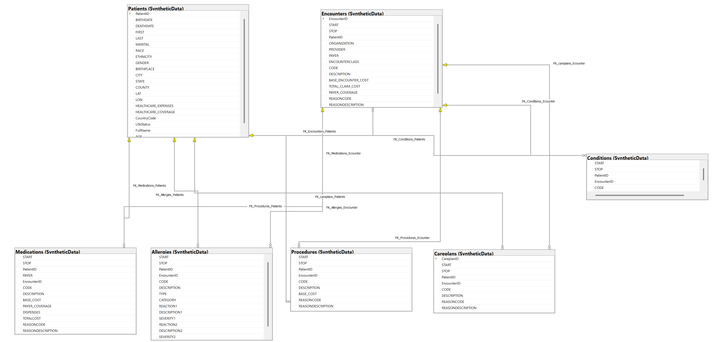
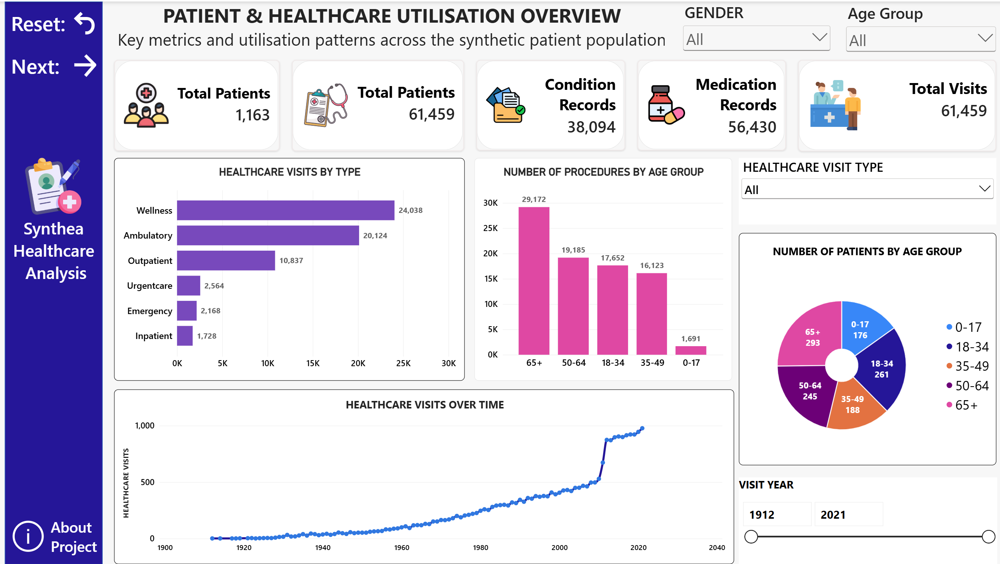
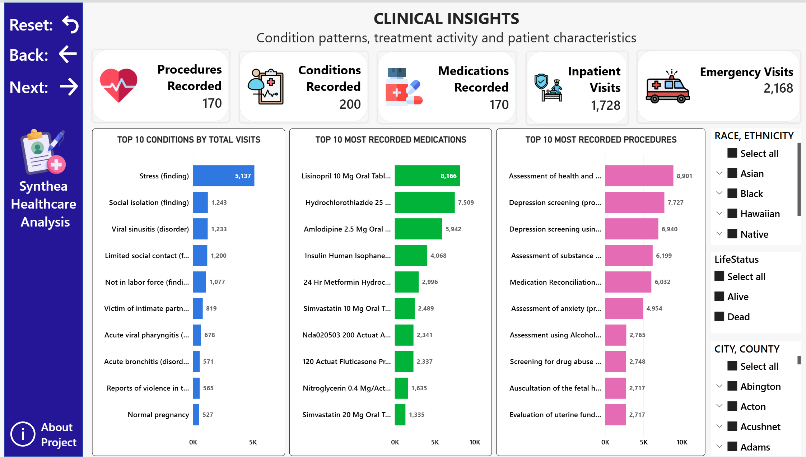
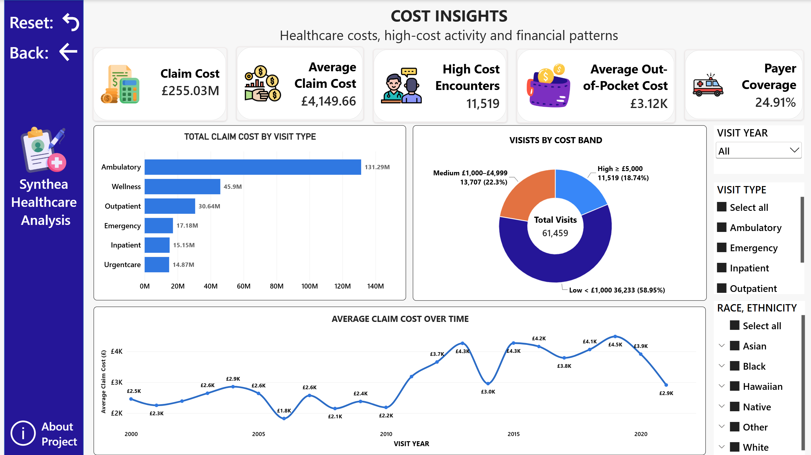

# Patient Conditions, Treatment and Healthcare Utilisation Analysis

## Project Overview

This project analyses **synthetic Synthea healthcare data** to understand patient demographics, healthcare utilisation, clinical conditions and findings, treatment activity and healthcare costs.

The analysis combines **SQL Server, Power BI, DAX and healthcare-focused data interpretation** to answer practical analytical questions such as:

- Which patient groups use healthcare services most frequently?
- Which types of healthcare visits occur most often?
- How does healthcare utilisation vary by age and gender?
- Which conditions and findings are associated with the greatest number of visits?
- Which medications and procedures are recorded most frequently?
- How concentrated is healthcare activity among high-utilisation patients?
- Which visit types generate the highest claim costs?
- How are healthcare visits distributed across low, medium and high-cost bands?
- How much of total claim cost is covered by payers?
- What data-quality issues could affect longitudinal healthcare analysis?

The project follows an end-to-end analytical workflow:

**database design → data validation → SQL analysis → derived metrics → DAX development → Power BI reporting → findings and recommendations**

Synthea generates synthetic healthcare records and does not contain real patient information.

---

<a id="quick-navigation"></a>

## Quick Navigation

| Data & Analysis | Reporting & Outcomes |
| :--- | :--- |
| [Business Objective](#business-objective) | [Power BI Analysis](#powerbi) |
| [Dataset](#dataset) | [Power BI Dashboard Preview](#dashboard-preview) |
| [Data Model](#data-model) | [Key Findings](#key-findings-section) |
| [Data Quality Validation](#data-quality-section) | [Recommendations](#recommendations-section) |
| [Core Healthcare KPIs](#core-kpis) | [Skills Demonstrated](#skills) |
| [SQL Analysis](#sql-analysis-section) | [Limitations](#limitations-section) |
| [Repository Structure](#repository-structure) | [Conclusion](#conclusion) |


---

<a id="business-objective"></a>

# Business Objective

The objective was not simply to count healthcare records, but to understand the patterns behind **patient activity, clinical burden, treatment utilisation and healthcare cost**.

The analysis focused on four main areas.

### [Patient and Healthcare Utilisation](#1-patient-and-healthcare-utilisation)

Understanding the patient population, visit frequency, visit types, utilisation patterns and changes in healthcare activity over time.

### [Clinical Activity](#2-clinical-conditions-and-findings)

Identifying frequently recorded conditions and findings, common medications, common procedures and differences across patient characteristics.

### [Healthcare Costs](#5-healthcare-cost-analysis)

Assessing total and average claim costs, high-cost encounters, payer coverage and the distribution of healthcare visits across cost bands.

### [Data Quality and Patient Timelines](#data-quality-section)

Validating relational integrity, clinical fields, healthcare costs and longitudinal patient timelines before interpreting analytical results.

[⬆ Back to Quick Navigation](#quick-navigation)

---

<a id="dataset"></a>

# Dataset and Database

The project uses synthetic patient-level CSV data generated by Synthea and imported into SQL Server.

Seven related healthcare tables were analysed.

| Table | Rows | Purpose |
|---|:---|---|
| Patients | 1,163 | Patient demographics and healthcare expenditure information |
| Encounters | 61,459 | Healthcare visits and encounter-level costs |
| Conditions | 38,094 | Diagnoses, conditions, findings and social observations |
| Medications | 56,430 | Medication records and medication costs |
| Procedures | 83,823 | Clinical procedures, assessments and treatments |
| Allergies | 794 | Patient allergy records |
| Careplans | 3,931 | Patient care plan records |

All **1,163 patients** had at least one recorded healthcare visit.

The available healthcare records cover a long historical period, with visit-year analysis spanning approximately **1912 to 2021** in the final Power BI report.

---

# Tools and Technologies

- **SQL Server 2025 Express**
- **SQL Server Management Studio**
- **T-SQL**
- **Power BI Desktop**
- **Power Query**
- **DAX**

---

<a id="data-model"></a>

# Data Model

The analytical model is centred on the **Patients** and **Encounters** tables.

`Patients` has one-to-many relationships with:

- Encounters
- Conditions
- Medications
- Procedures
- Allergies
- Careplans

`Encounters` also connects with the clinical activity tables through `EncounterID`.

Primary keys were implemented for:

- `Patients.PatientID`
- `Encounters.EncounterID`
- `Careplans.CareplanID`

Foreign-key relationships were used to validate patient and encounter links across the clinical tables.



### Explore the Database Structure

[View Primary and Foreign Key SQL](./SQL/01_primary_foreign_key_constraints.sql)

[View Healthcare Data Dictionary](./Documentation/Synthea_Healthcare_Data_Dictionary.xlsx)

---

<a id="data-quality-section"></a>

# Data Quality Validation

Before calculating healthcare KPIs or interpreting patient activity, I performed structural, clinical, cost and longitudinal validation.

Checks included:

- row counts
- duplicate primary keys
- NULL primary keys
- unmatched patient relationships
- unmatched encounter relationships
- missing clinical codes
- missing clinical descriptions
- negative healthcare costs
- invalid START and STOP sequences
- patient death before birth
- healthcare visits before patient birth
- healthcare visits after recorded patient death

## Structural Validation

The structural validation found no major integrity issues:

- **No duplicate or NULL primary keys** were identified in the tested tables.
- **No unmatched patient or encounter relationships** were found.
- **No missing key clinical codes or descriptions** were identified.
- **No negative values** were found in the tested healthcare cost fields.

## Timeline Validation Findings

Two logical timeline issues were identified:

- **Medication date inconsistency:**  
  **5 medication records** had a `STOP` date earlier than the corresponding `START` date.

- **Healthcare visits after recorded death:**  
  **165 healthcare visits** occurred after the associated patient's recorded death date.

These issues were documented rather than silently corrected because they may affect medication-duration and longitudinal patient-journey analysis.

### Explore the Validation Work

[View Data Quality SQL](./SQL/02_data_quality_validation.sql)

[View Date and Logical Validation SQL](./SQL/03_date_logical_validation.sql)

[View Clinical and Cost Validation SQL](./SQL/04_clinical_cost_validation.sql)

[View Data Quality Summary](./Findings/data_quality_summary.md)

---

<a id="core-kpis"></a>

# Core Healthcare KPIs

| KPI | Result |
| :--- | :--- |
| Total Patients | 1,163 |
| Total Healthcare Visits | 61,459 |
| Condition Records | 38,094 |
| Medication Records | 56,430 |
| Procedure Records | 83,823 |
| Total Claim Cost | £255.03M |
| Average Claim Cost | £4,149.66 |
| High-Cost Encounters | 11,519 |
| Payer Coverage | 24.91% |

These KPIs provide the overall healthcare context, but the more important analytical question is **what is driving patient activity and healthcare cost**.

---

<a id="sql-analysis-section"></a>

# SQL Analysis

The SQL analysis was structured around healthcare and analytical questions rather than isolated technical exercises.

The analysis combined patient-level aggregation, clinical activity, healthcare utilisation, segmentation and cost analysis.

---

## 1. Patient and Healthcare Utilisation

### Business Questions

- How many patients and healthcare visits are recorded?
- Which visit types occur most frequently?
- Which patients have the highest healthcare utilisation?
- How does utilisation vary across age groups?
- How does average utilisation differ by gender?
- How concentrated is healthcare activity among high-utilisation patients?
- How has healthcare activity changed over time?

### Key Findings

- **Finding 1: Healthcare activity was concentrated in routine visit types.**  
  Wellness and Ambulatory visits accounted for the largest share of healthcare activity.

| Visit Type | Healthcare Visits |
| :--- | :--- |
| Wellness | 24,038 |
| Ambulatory | 20,124 |
| Outpatient | 10,837 |
| Urgent Care | 2,564 |
| Emergency | 2,168 |
| Inpatient | 1,728 |

- **Finding 2: Utilisation was concentrated among older patients and a very small high-use group.**  
  Patients aged **65+ recorded 27,615 healthcare visits**, the highest of any age group.

| Utilisation Group | Patients | Share |
| :--- | :--- | :--- |
| Low Utilisation | 725 | 62.34% |
| Medium Utilisation | 423 | 36.37% |
| High Utilisation | 15 | 1.29% |

Only **15 patients (1.29%)** were classified as High Utilisation, showing that extreme healthcare use was concentrated in a very small patient segment.

Female patients also recorded higher average utilisation at **57.68 visits per patient**, compared with **47.40 among male patients**.

### Insight

Healthcare demand in the synthetic population was shaped by both **routine visit activity** and **concentrated utilisation among older and high-use patients**, indicating that visit type, age and patient-level utilisation should be considered together.

### Techniques Used

`Aggregation` `CTEs` `CASE` `COUNT(DISTINCT)` `Patient-Level Aggregation`<br>
`Age Segmentation` `Utilisation Segmentation` `Percentage Calculations` `Date Analysis`

[View Business Analysis SQL](./SQL/06_business_analysis.sql)

[⬆ Back to Quick Navigation](#quick-navigation)

---

## 2. Clinical Conditions and Findings

### Business Questions

- Which conditions and findings are associated with the greatest number of healthcare visits?
- How does condition burden vary by age?
- Which clinical patterns differ across demographic groups?
- How many unique condition types are represented?

### Key Findings

- **Finding 1: The Conditions table includes both clinical diagnoses and broader social or contextual findings.**  
  Records include items such as **stress, social isolation, employment status and behavioural observations**, so disease-specific interpretation requires care.

  After excluding the highly dominant **Full-time employment** and **Part-time employment** findings, frequently recorded conditions and findings included:

  - Stress
  - Social isolation
  - Viral sinusitis
  - Limited social contact
  - Not in labour force
  - Victim of intimate partner abuse
  - Acute viral pharyngitis
  - Acute bronchitis

- **Finding 2: Condition burden increased substantially with age.**  
  Patients aged **65+ recorded the highest average distinct condition burden at 18.56 conditions per patient**, compared with **4.02 among patients aged 0–17**.

| Age Group | Average Conditions Per Patient |
| :--- | :--- |
| 65+ | 18.56 |
| 50–64 | 16.29 |
| 35–49 | 14.37 |
| 18–34 | 10.66 |
| 0–17 | 4.02 |

This shows a clear increase in recorded condition burden across older age groups within the synthetic population.

### Insight

The clinical profile shows that interpretation requires both **age-related condition burden** and the distinction between **medical diagnoses and broader social or contextual findings**, rather than treating all condition records as equivalent.

### Techniques Used

`COUNT(DISTINCT)` `Multi-Table Joins` `Age Segmentation` `Clinical Ranking`<br>
`Patient-Level Aggregation` `Condition Burden Analysis`

[View Demographic and Clinical Analysis SQL](./SQL/07_demographic_clinical_analysis.sql)

[⬆ Back to Quick Navigation](#quick-navigation)

---

## 3. Medication Activity

### Business Question

Which medications are recorded most frequently?

### Key Findings

- **Finding 1: Cardiovascular medications dominated the most frequently recorded treatments.**  
  Lisinopril, Hydrochlorothiazide and Amlodipine were the three most commonly recorded medications.

| Medication | Records |
| :--- | :--- |
| Lisinopril 10 MG Oral Tablet | 8,166 |
| Hydrochlorothiazide 25 MG | 7,509 |
| Amlodipine 2.5 MG Oral Tablet | 5,942 |
| Insulin Human Isophane | 4,068 |
| Metformin | 2,996 |
| Simvastatin 10 MG Oral Tablet | 2,489 |

- **Finding 2: The medication profile reflects substantial cardiovascular and metabolic treatment activity.**  
  Frequently recorded therapies included antihypertensive, lipid-lowering and diabetes-related medications, indicating a strong presence of cardiovascular and metabolic care within the synthetic population.

### Insight

The concentration of cardiovascular and metabolic medications is consistent with the higher condition burden observed among older patients and suggests that chronic disease management represents an important component of treatment activity in the dataset.
### Techniques Used

`Aggregation` `GROUP BY` `Ranking` `Top N Analysis`

[View Business Analysis SQL](./SQL/06_business_analysis.sql)

[⬆ Back to Quick Navigation](#quick-navigation)

---

## 4. Procedure Activity

### Business Question

Which procedures and healthcare assessments are recorded most frequently?

### Key Findings

- **Finding 1: Preventive and assessment-based procedures dominated the most frequently recorded activity.**  
  Several of the leading procedures focused on screening, assessment and care review rather than direct treatment.

Leading procedure activity included:

- Assessment of health and social care needs
- Depression screening
- PHQ-based depression screening
- Assessment of substance use
- Medication reconciliation
- Assessment of anxiety

- **Finding 2: Behavioural-health and social-care activity formed an important part of the procedure profile.**  
  Depression, anxiety, substance-use and social-care assessments appeared repeatedly among the most common procedures.

### Insight

The procedure profile suggests that healthcare activity in the dataset extends beyond treatment alone, with a strong emphasis on **preventive care, behavioural-health screening and ongoing patient assessment**.

### Techniques Used

`Aggregation` `Procedure Ranking` `Top N Analysis` `Clinical Activity Interpretation`

[View Business Analysis SQL](./SQL/06_business_analysis.sql)

[⬆ Back to Quick Navigation](#quick-navigation)

---

## 5. Healthcare Cost Analysis

### Business Questions

- Which healthcare visit types generate the highest total claim cost?
- Which visit types have the highest average claim cost?
- How many encounters fall into low, medium and high-cost bands?
- What proportion of claim cost is covered by payers?
- How have average healthcare costs changed over time?

### Key Findings

- **Finding 1: Healthcare costs were substantial across the dataset.**  
  Total claim cost reached approximately **£255.03M**, with an average claim cost of **£4,149.66 per healthcare visit**.

- **Finding 2: Ambulatory care generated the highest total claim cost.**  
  Ambulatory visits accounted for approximately **£131.29M**, making them the largest contributor to overall claim expenditure.

- **Finding 3: Inpatient care had the highest average claim cost.**  
  Although inpatient visits were less frequent, they carried the greatest average financial burden per visit.

## Cost Bands

Healthcare visits were segmented using analyst-defined thresholds.

| Cost Band | Definition | Visits | Share |
| :--- | :--- | :--- | :--- |
| Low Cost | < £1,000 | 36,233 | 58.95% |
| Medium Cost | £1,000 to < £5,000 | 13,707 | 22.30% |
| High Cost | ≥ £5,000 | 11,519 | 18.74% |

- **Finding 4: Most healthcare visits were low cost, but high-cost activity remained significant.**  
  **58.95%** of visits were below £1,000, while **18.74%** were classified as High Cost.

### Insight

The cost profile shows that total expenditure is influenced by both **high-volume visit types such as ambulatory care** and **high-cost visit types such as inpatient care**, meaning frequency and cost intensity should be assessed together.

### Techniques Used

`SUM` `AVG` `ROUND` `DIVIDE` `NULLIF` `CASE`<br>
`Cost Segmentation` `Percentage Analysis` `Visit-Type Comparison`

[View Business Analysis SQL](./SQL/06_business_analysis.sql)

[⬆ Back to Quick Navigation](#quick-navigation)

---

<a id="powerbi"></a>

# Power BI Analysis and Dashboard

The Power BI stage translates the SQL analysis into an interactive three-page healthcare report.

The report allows patient, clinical and financial patterns to be explored using interactive filters and cross-filtering.

## Interactive Dashboard

[Download Synthea Healthcare Analysis.pbix](./POWERBI/Synthea_Healthcare_Analysis.pbix)

The final report includes:

1. Patient & Healthcare Utilisation Overview
2. Clinical Insights
3. Cost Insights

---

<a id="dashboard-preview"></a>

# Power BI Dashboard Preview

The screenshots below allow the report to be reviewed directly in GitHub without downloading Power BI Desktop.

---

## 1. Patient & Healthcare Utilisation Overview

The overview page provides a high-level view of patient volume and healthcare utilisation.

It includes:

- total patients
- total healthcare visits
- condition records
- medication records
- healthcare visits by type
- procedures by age group
- patient distribution by age group
- healthcare visits over time
- gender filtering
- age-group filtering
- healthcare visit-type filtering
- visit-year filtering



[Download Interactive Dashboard.pbix](./POWERBI/Synthea_Healthcare_Analysis.pbix)

[⬆ Back to Power BI](#powerbi)  

---

<a id="clinical-dashboard"></a>

## 2. Clinical Insights

The Clinical Insights page explores patient conditions and findings, medication activity, procedure activity and patient characteristics.

Headline indicators include:

- Procedure Types
- Condition Types
- Medication Types
- Inpatient Visits
- Outpatient Visits
- Emergency Visits

The page also includes:

- Top 10 Conditions & Findings by Visits
- Top 10 Most Recorded Medications
- Top 10 Most Recorded Procedures
- Race/Ethnicity filtering
- Life Status filtering
- City/County filtering

The Conditions table includes both clinical diagnoses and broader findings, so the dashboard explicitly describes the ranking as **Conditions & Findings** rather than treating every record as a disease.



[Download Interactive Dashboard.pbix](./POWERBI/Synthea_Healthcare_Analysis.pbix)

---

<a id="cost-dashboard"></a>

## 3. Cost Insights

The Cost Insights page focuses on healthcare expenditure, cost concentration and payer coverage.

Headline indicators include:

- total claim cost
- average claim cost
- high-cost encounters
- average out-of-pocket cost
- payer coverage percentage

The page also includes:

- total claim cost by healthcare visit type
- healthcare visits by cost band
- average claim cost over time
- visit-year filtering
- healthcare visit-type filtering
- race/ethnicity filtering

Cost-band definitions are shown directly in the visual:

- **Low Cost:** below £1,000
- **Medium Cost:** £1,000 to below £5,000
- **High Cost:** £5,000 or more



[Download Interactive Dashboard.pbix](./POWERBI/Synthea_Healthcare_Analysis.pbix)

---

<a id="skills"></a>

# Power BI Skills Demonstrated

This project demonstrates practical experience in:

- relational data modelling
- Power Query
- DAX measures
- calculated columns
- filter context
- `CALCULATE`
- `DIVIDE`
- `CROSSFILTER`
- `TREATAS`
- `SWITCH`
- `DISTINCTCOUNT`
- calculated cost bands
- patient segmentation
- Top N filtering
- slicers
- cross-filtering
- visual interactions
- report navigation
- reset buttons
- KPI development
- dashboard layout and design
- healthcare-focused reporting

---

# SQL Skills Demonstrated

- relational database design
- primary and foreign keys
- aggregate functions
- `INNER JOIN`
- `LEFT JOIN`
- multi-table joins
- common table expressions
- subqueries
- `CASE`
- `COUNT(DISTINCT)`
- `GROUP BY`
- `HAVING`
- `NULL` handling
- `NULLIF`
- date functions
- `DATEDIFF`
- `YEAR`
- `MONTH`
- `FORMAT`
- `TRY_CAST`
- percentage calculations
- patient segmentation
- cost segmentation
- referential-integrity validation
- logical timeline validation
- healthcare KPI development

---

# Healthcare Analysis Skills Demonstrated

- patient utilisation analysis
- demographic segmentation
- condition burden analysis
- medication activity analysis
- procedure activity analysis
- healthcare cost analysis
- payer coverage analysis
- high-utilisation patient identification
- high-cost encounter identification
- clinical and social finding interpretation
- data-quality assessment
- longitudinal healthcare validation
- translating analytical findings into recommendations

[⬆ Back to Quick Navigation](#quick-navigation)

---

<a id="key-findings-section"></a>

# Key Findings

The analysis identified several important healthcare patterns.

- **Older patients had the highest healthcare utilisation.**  
  Patients aged 65+ recorded **27,615 visits** and the highest average condition burden. This suggests that healthcare complexity increases across older age groups within the synthetic population.

- **Condition burden increased substantially with age.**  
  Average distinct conditions rose from **4.02 in patients aged 0–17** to **18.56 in patients aged 65+**.

- **High utilisation was concentrated in a very small patient group.**  
  Only **15 patients (1.29%)** were classified as High Utilisation.

- **Routine care accounted for most healthcare activity.**  
  Wellness and ambulatory visits dominated overall utilisation, while inpatient and emergency visits were less frequent.

- **Inpatient care carried the highest average financial burden.**  
  Inpatient visits recorded the highest average claim and out-of-pocket costs.

- **Most healthcare visits were relatively low cost.**  
  **58.95%** of visits cost below £1,000, while **18.74%** were classified as High Cost.

- **Condition records included both clinical and contextual findings.**  
  Social, behavioural and employment-related findings appeared alongside medical diagnoses and require careful interpretation.

- **Timeline validation identified important logical inconsistencies.**  
  **5 medication records** had invalid date sequences and **165 visits** occurred after recorded patient death.

### Explore the Full Findings

[View Detailed Key Findings](./Findings/key_findings.md)

[⬆ Back to Quick Navigation](#quick-navigation)

---

<a id="recommendations-section"></a>

# Recommendations

The findings were translated into analytical and operational recommendations.

The main priorities identified were:

1. Prioritise high-utilisation patients for targeted review and deeper utilisation analysis.
2. Assess patient complexity using both healthcare utilisation and condition burden rather than relying on visit frequency alone.
3. Incorporate age into healthcare demand planning, as older patients show substantially higher utilisation and condition burden.
4. Monitor inpatient and emergency activity closely because these visit types carry the highest average financial burden.
5. Evaluate high-cost conditions using both cost intensity and frequency to identify the strongest drivers of healthcare expenditure.
6. Separate clinical diagnoses from social and contextual findings to improve the accuracy of condition-based reporting.
7. Report preventive, behavioural-health and social-care activity separately from treatment procedures for clearer clinical interpretation.
8. Use cost bands to identify where high-cost healthcare activity is concentrated and where further review may be most valuable.
9. Investigate demographic differences in utilisation to identify patient groups with consistently higher healthcare activity.
10. Use city-level analysis where possible to provide more meaningful geographic insight than state-level comparison.
11. Maintain patient timeline validation as a routine data-quality control before conducting longitudinal analysis.
12. Clearly document synthetic-data limitations and logical inconsistencies so findings are interpreted within the correct context.

[View Full Recommendations](./Findings/recommendations.md)

[⬆ Back to Quick Navigation](#quick-navigation)

---

<a id="limitations-section"></a>

# Limitations

- **Synthetic dataset.**  
  Synthea data does not represent a real patient population or healthcare organisation.

- **Conditions include more than diagnoses.**  
  The Conditions table contains clinical, social, behavioural and contextual findings, so not every record should be interpreted as a disease.

- **Geographic analysis is limited.**  
  The dataset is concentrated in Massachusetts, making state-level comparison less meaningful than city-level analysis.

- **Some timeline inconsistencies remain.**  
  A small number of medication date errors and post-death healthcare visits were identified during validation.

- **Patient age is approximate.**  
  Age was calculated using year difference rather than an exact birthday-adjusted method.

- **Analytical segments are exploratory.**  
  Utilisation groups and cost bands were analyst-defined and are not official clinical classifications.

[⬆ Back to Quick Navigation](#quick-navigation)

---
<a id="conclusion"></a>

# Conclusion

The analysis of **1,163 synthetic patients and 61,459 healthcare visits** identified clear patterns across patient utilisation, clinical activity and healthcare costs.

Patients aged **65+ recorded the highest healthcare utilisation** and also showed the greatest average condition burden, indicating that healthcare activity in the synthetic population increased substantially with age.

Healthcare utilisation was also concentrated within a relatively small group of patients. Only **15 patients, representing 1.29% of the population**, were classified as High Utilisation.

Routine healthcare activity was dominated by **Wellness and Ambulatory visits**, while Inpatient and Emergency care occurred less frequently but generated a higher average financial burden.

The clinical analysis showed substantial medication, procedure and behavioural-health activity. It also highlighted an important interpretation issue: the Conditions table contains both medical diagnoses and broader social or contextual findings, meaning that not every condition record should be interpreted as a disease.

From a financial perspective, the dataset generated approximately **£255.03M in total claim cost**. Most healthcare visits were classified as Low Cost, while **18.74%** fell into the High Cost category.

The project also demonstrated the importance of healthcare-specific data validation. Although the relational structure and key clinical fields were generally consistent, logical validation identified **5 medication records with invalid date sequences** and **165 healthcare visits recorded after patient death**.

Overall, the project demonstrates an end-to-end healthcare analytics workflow:

**relational data → data validation → healthcare questions → SQL analysis → derived measures → DAX → interactive Power BI reporting → analytical findings and recommendations**

[⬆ Back to Quick Navigation](#quick-navigation)

---

<a id="repository-structure"></a>

# Repository Structure

```text
Synthea_Healthcare_Analysis/
│
├── README.md
│
├── SQL/
│   ├── 01_primary_foreign_key_constraints.sql
│   ├── 02_data_quality_validation.sql
│   ├── 03_date_logical_validation.sql
│   ├── 04_clinical_cost_validation.sql
│   ├── 05_derived_fields_calculations.sql
│   ├── 06_business_analysis.sql
│   └── 07_demographic_clinical_analysis.sql
│
├── Findings/
│   ├── data_quality_summary.md
│   ├── key_findings.md
│   └── recommendations.md
│
├── POWERBI/
│   └── Synthea_Healthcare_Analysis.pbix
│
├── Images/
│   ├── synthea_data_model.png
│   ├── 01_healthcare_utilisation_overview.png
│   ├── 02_clinical_insights.png
│   └── 03_cost_insights.png
│
└── Documentation/
    └── Synthea_Healthcare_Data_Dictionary.xlsx
```

[⬆ Back to Quick Navigation](#quick-navigation)

---

<a id="project-files-section"></a>

# Project Files

## SQL Analysis

[Primary and Foreign Key Constraints](./SQL/01_primary_foreign_key_constraints.sql)

[Data Quality Validation](./SQL/02_data_quality_validation.sql)

[Date and Logical Validation](./SQL/03_date_logical_validation.sql)

[Clinical and Cost Validation](./SQL/04_clinical_cost_validation.sql)

[Derived Fields and Calculations](./SQL/05_derived_fields_calculations.sql)

[Business Analysis](./SQL/06_business_analysis.sql)

[Demographic and Clinical Analysis](./SQL/07_demographic_clinical_analysis.sql)

---

## Findings

[Data Quality Summary](./Findings/data_quality_summary.md)

[Key Findings](./Findings/key_findings.md)

[Recommendations](./Findings/recommendations.md)

---

## Power BI

[Download Synthea Healthcare Analysis.pbix](./POWERBI/Synthea_Healthcare_Analysis.pbix)

---

## Dashboard Images

[Patient & Healthcare Utilisation Overview](./Images/01_healthcare_utilisation_overview.png)

[Clinical Insights](./Images/02_clinical_insights.png)

[Cost Insights](./Images/03_cost_insights.png)

[Healthcare Data Model](./Images/synthea_data_model.png)

---

## Documentation

[Synthea Healthcare Data Dictionary](./Documentation/Synthea_Healthcare_Data_Dictionary.xlsx)

[⬆ Back to Quick Navigation](#quick-navigation)

---

## Author

**Dr Mahreen Kiran**

**Business Data Analyst | BI Analyst**

[View Main Portfolio](../README.md)

[LinkedIn](https://linkedin.com/in/mahreen-kiran)

---

[⬆ Back to Quick Navigation](#quick-navigation)
